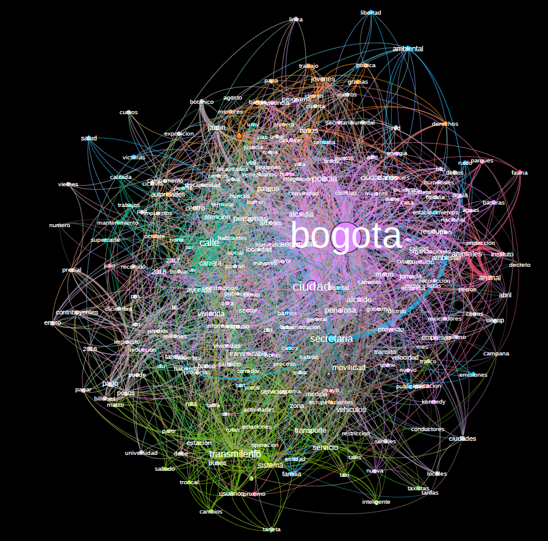

# News_Bogota_2013_2019

# Análisis de las noticias publicadas por la Alcaldía Mayor de Bogotá, desde Enero de 2016 a Mayo de 2019

[Sebastián Castro Rodríguez](https://www.linkedin.com/in/sebasti%C3%A1n-castro-rodr%C3%ADguez/)

25-May-2019

---

## Descripción y Motivación

La alcaldía mayor de Bogotá publica en su sitio web las noticias por temas de interés que ocurren en la capital del país periódicamente. Para este proyecto voy a realizarle scrapping y análisis por medio de herramientas en Python a cada una de las noticias (alrededor de 2600) que tratan acerca de los temas de a) Movilidad, b) Gobierno, Seguridad y Convivencia, c) Ambiente, d) Hábitat, e) Integración Social, f) Hacienda, dado que han sido de los grandes temas coyunturales en la actual alcaldía de Enrique Peñaloza. 

Adicional a esto se hace un pequeño analisis acerca de algunas palabras que han sido parte de los temas de agenda en las dos pasadas administraciones.

Algunas preguntas/ problemas que motivan este proyecto son:

- ¿Los datos reflejan la relación entre el metro y el Transmilenio en la capital, y si es así, la información esta inclinada hacia el Transmilenio ?
- ¿Han sido efectivas las soluciones de prohibición de parrillero, pico y placa, entre otras medidas para solucionar temas de seguridad y movilidad, y si así lo ha sido, cual es la posición desde la alcaldía?
- ¿De alguna manera el alcalde vió viable la opción de cobrar peajes dentro de la ciudad, y si así fue, los datos de las noticias lo reflejan?
- ¿Que relación existe entre el “Bronx” y el consumo de estupefacientes? ¿Después del desalojo, mejoró la situación?
- ¿De alguna manera los datos reflejan las intervenciones que se han realizado por parte de la fuerza pública en las protestas llevadas a cabo en la ciudad? 

## Metodos Utilizados

1. Scraping
    - Las noticias por parte de la Alcaldía estan disponibles online en 6 batches, provenientes de la sección Bogotá por temas.
        - Batch 1: desde 01/01/2016 to 03/05/2019 (675 noticias de gobierno, seguridad y convivencia ciudadana): https://bogota.gov.co/mi-ciudad/seguridad
        - Batch 2: desde 01/01/2016 hasta 03/05/2019 (889 noticias de movilidad): https://bogota.gov.co/mi-ciudad/movilidad
        - Batch 3: desde 01/01/2016 hasta 03/05/2019 (233 noticias de integración social): https://bogota.gov.co/mi-ciudad/integracion-social
        - Batch 4: desde 01/01/2016 hasta 03/05/2019 (153 noticias de hacienda): https://bogota.gov.co/mi-ciudad/hacienda
        - Batch 5: desde 01/01/2016 hasta 03/05/2019 (289 noticias de hábitat): https://bogota.gov.co/mi-ciudad/habitat
        - Batch 6: desde 01/01/2016 hasta 03/05/2019 (458 noticias de ambiente): https://bogota.gov.co/mi-ciudad/ambiente

        Además de los anteriores scrapping, se añade un analisis pequeño realizandole scrapping de la misma metodologia pero añadiendole el periodo de tiempo de la administración de Gustavo Petro.
        - Las noticias por parte de la Alcaldía en esta seccion esta disponible online en 1 batch, provenientes de la página de la alcaldía de Bogotá. 
        - Batch: desde 01/11/2012 to 22/05/2019 (6870 noticias de temas variados): https://bogota.gov.co/mi-ciudad
    
    - Para hacer scrapping de todas las noticias utilice las librerias 'requests' y 'BeautifulSoup'.
    - El codigo de Python esta disponible [aqui para todos los batches](Notebook/Proyecto_Final.ipynb)
  
2. Extrayendo los datos desde objetos de 'BeatifulSoup':
    - Para scrappear el texto en crudo y los datos provenientes de este, me apoye sobre las funciones realizadas por Santiago Matallana en su trabajo de discursos presidenciales como lo son: get htmls para obtener los htmls de las noticias; get urls para localizarlas todas; get date para buscar la fecha de cada una de las noticias; get titlepara obtener el titulo de cada noticia; remove html tags para eliminar caracteres especiales ocultos dentro del html y finalmente reunir todos estos datos como un objeto estructurado para ponerlo en pandas.
    - Estas funciones de ayuda esta dispinibles tambien en el documento del notebook inicial.[Haga click aquí](Notebook/Proyecto_Final.ipynb).
    - Además, lo anterior tambien se realizó para el análisis con el periodo extendido [Aquí se encuentra el código](Proyecto_Extendido/Code/Proyecto_Extendido_Periodo_2012-2019.ipynb)
  
3. Manejo, guardado y limpieza de datos:
   - Utilice 'Pandas' para crear un data frame para cada batch de noticias, y luego exporte cada uno a un archivo 'pickle' para guardarlo. 
   - Consolide los 6 data frames en uno y realice después la limpieza de las noticias utilizando metodos de la libreria 'Pandas', mettodos de texto, y expresiones regulares entre otras cosas.
    - Utilice las librerias 'string' y 'nltk' para quitarle los signos de puntuación a las noticias, ademas deje el formato de texto en una sola estructura de minisculas para solucioonar problemas de repeticion de las palabras. Borre las palabras de conexion, separé las palabras e hice el análisis respectivo.
    - Realice un emparejamineto de palabras para realizar dos archivos csv que pudiera analizar en Gephi para realizar análisis de redes. 
    - El codigo esta disponible en los mismos notebooks anteriormente mencionados.
    

## Hallazgos Batch Peñaloza

- Número de noticias disponibles: 2650
- Maximo número de noticias en un dia: 12
- Los titulos de noticias de este dia:   

'Policía salva la vida de un hombre que estaba en el baúl de un taxi',  
 'Capturan hombre que robaba láminas de puentes peatonales',  
 'Las tiernas razones por las que la gente ama a su perro',  
 'Más de 100 árboles serán sembrados en el centro de Bogotá',  
 '2.000 árboles nuevos para los cerros orientales',  
 'En Bogotá se acabarán los taxímetros, le contamos por qué',  
 'La velocidad para los carros en la Zona G mejoró 37 %',  
 'Accidentalidad de taxis cayó 13 % en Bogotá',  
 'Cortes de agua del 24 al 28 de julio de 2017',  
 '¿Sueña con casa propia? Habrá cuatro ferias de vivienda en Bogotá',  
 'Van 461 casos menos de hurto a comercio en Bogotá',  
 'En cinco meses se resolverán delitos menores con Ley de pequeñas causas'
 
 ## Hallazgos Batch Extendido

- Número de noticias disponibles: 6870
- Maximo número de noticias en un dia: 46

Aqui algunas visualizaciones de hallazgos clave:

Las lineas azules verticales indican los meses donde más publicaciones se hicieron por parte de la Alcaldía Mayor de Bogotá.

Las lineas azules verticales indican los meses en los cuales se realizó la intervencion en el bronx y posteriormente la demolición de este espacio.

La linea azul indica el cambio de administración a la alcaldía de Enrique Peñaloza.

Grafico de dispersión de las veces que se mencionan los nombres de algunos de los candidatos anteriores y actuales para la alcaldía.

Grafico de dispersión de las veces que se mencionan unas de las palabras más controversiales en las dos pasadas administraciones.
